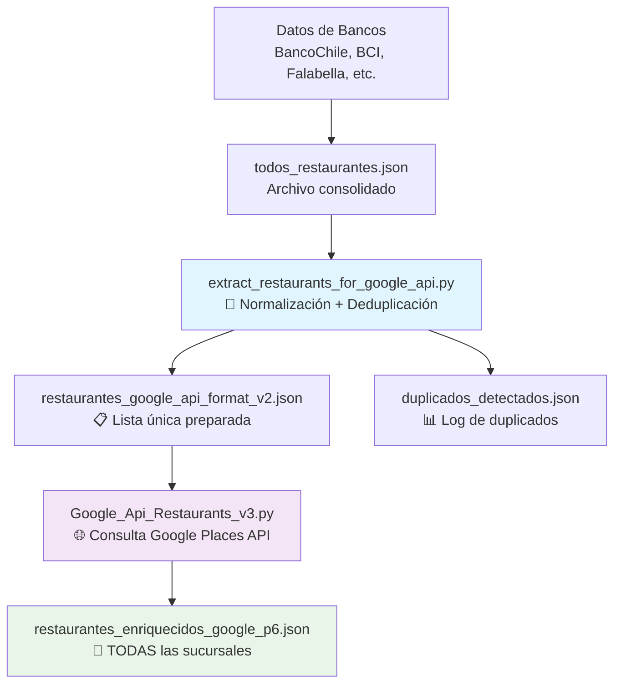
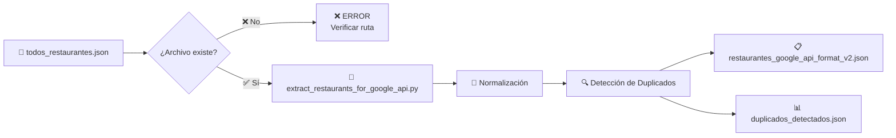
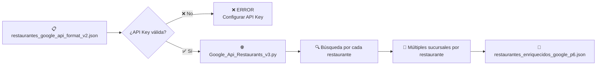
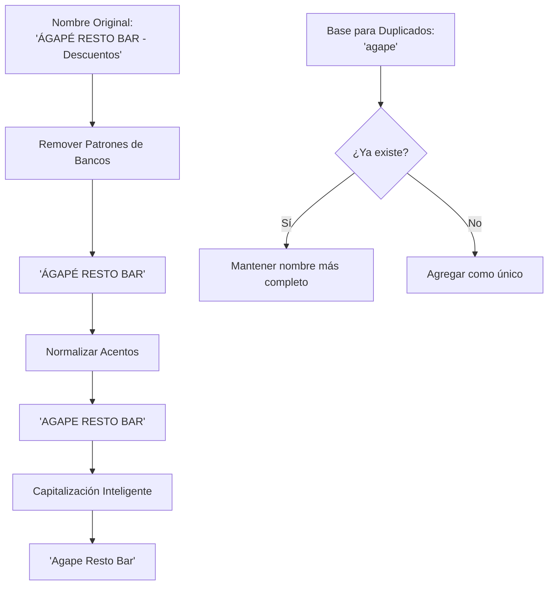
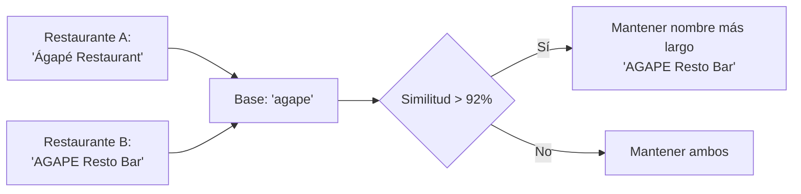
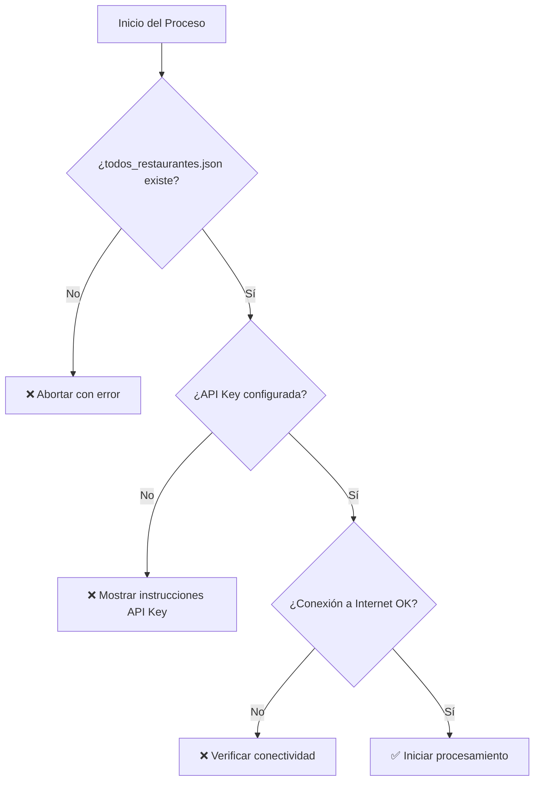
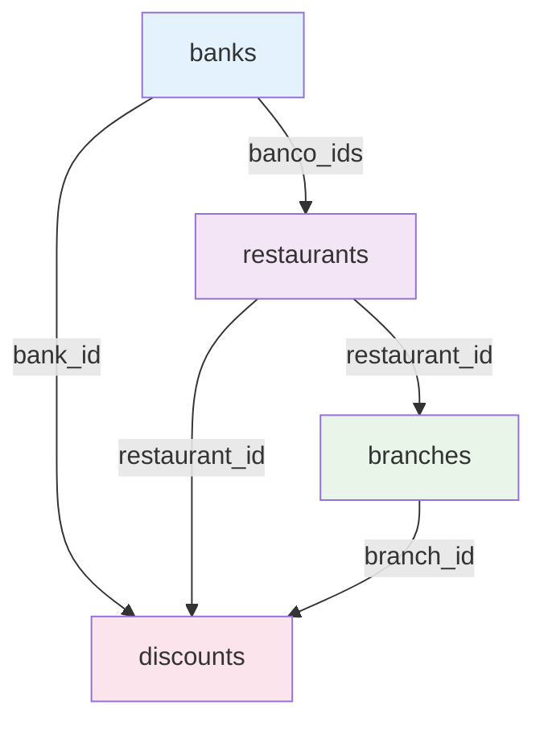
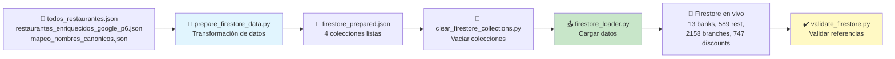

# 📋 MANUAL TÉCNICO - SISTEMA SAVR
## Extracción y Enriquecimiento de Restaurantes con Google Places API

---

## 🎯 **OBJETIVO DEL SISTEMA**
Procesar datos de restaurantes desde múltiples bancos, eliminar duplicados inteligentemente y enriquecer con información completa de Google Places API obteniendo **TODAS las sucursales** de cada restaurante.

---

## 🏗️ **ARQUITECTURA DEL SISTEMA**



---

## 🔄 **FLUJO DE EJECUCIÓN COMPLETO**

### **FASE 1: Preparación de Datos**



### **FASE 2: Enriquecimiento con Google API**



---

## ⚙️ **COMANDOS DE EJECUCIÓN**

### **1️⃣ PASO 1: Normalización y Deduplicación**
```bash
cd "C:\Malla\Python\Mayo\Unificador\Direcciones\Limpio"
python extract_restaurants_for_google_api.py
```

**📥 INPUT:** `todos_restaurantes.json`  
**📤 OUTPUT:**
- `restaurantes_google_api_format_v2.json` - Lista preparada para Google API
- `duplicados_detectados.json` - Log detallado de duplicados

### **2️⃣ PASO 2: Enriquecimiento con Google Places API (Múltiples Sucursales)**
```bash
python Google_Api_Restaurants_v3.py
```

**📥 INPUT:** `restaurantes_google_api_format_v2.json`  
**📤 OUTPUT:** `restaurantes_enriquecidos_google_p6.json`

---

## 🔧 **CONFIGURACIÓN REQUERIDA**

### **API Key de Google Places**
```python
# En Google_Api_Restaurants_v3.py - Línea ~265
API_KEY = "TU_API_KEY_AQUI"
```

### **Obtener API Key:**
1. 🌐 **Google Cloud Console:** https://console.cloud.google.com/
2. 🔑 **Habilitar:** Places API (New)
3. 🎫 **Crear:** API Key
4. 💰 **Configurar:** Billing account (requerido)

---

## 📊 **ESTRUCTURA DE DATOS**

### **Entrada: todos_restaurantes.json**
```json
[
  {
    "Nombre": "Ágapé Resto Bar - Descuentos",
    "Bancos": "BancoChile",
    "Categoria": "Restaurante"
  }
]
```

### **Intermedio: restaurantes_google_api_format_v2.json**
```json
{
  "metadata": {
    "total_restaurantes": 1250,
    "ciudad_contexto": "Santiago, Chile",
    "version_extractor": "2.0 - Normalización Inteligente"
  },
  "restaurantes": [
    {
      "id": 1,
      "nombre_busqueda": "Ágapé Resto Bar",
      "query_completa": "Ágapé Resto Bar, Santiago, Chile",
      "procesado": false
    }
  ]
}
```

### **Salida Final: restaurantes_enriquecidos_google_p6.json**
```json
{
  "metadata": {
    "total_restaurantes_base": 1250,
    "total_sucursales_encontradas": 3850,
    "promedio_sucursales_por_restaurante": 3.08,
    "fecha_procesamiento": "2026-05-06T10:30:00"
  },
  "sucursales": [
    {
      "id_base": 1,
      "nombre_busqueda": "Ágapé Resto Bar",
      "sucursal_numero": 1,
      "google_place_id": "ChIJ...",
      "nombre_google": "Ágapé Resto Bar",
      "direccion": "Av. Providencia 123, Santiago",
      "ubicacion": {
        "latitude": -33.4489,
        "longitude": -70.6693
      },
      "rating": 4.2,
      "total_reviews": 156,
      "telefono": "+56223456789",
      "website": "https://agape.cl",
      "google_maps_url": "https://maps.google.com/?cid=123",
      "tipos": ["restaurant", "food", "establishment"],
      "business_status": "OPERATIONAL"
    }
  ]
}
```

---

## 🚦 **PROCESO DE NORMALIZACIÓN**

### **Patrones de Limpieza Automática**



### **Palabras Removidas Automáticamente**
- **Sufijos:** Restaurant, Restaurante, Bar, Café, Bistro, Lounge
- **Patrones de Bancos:** "- Descuentos", "- MUT", "- Mall xyz"
- **Redundancias:** "Priceless by Mastercard", "Menú Priceless"

---

## 📈 **MÉTRICAS DEL SISTEMA**

### **Estadísticas Típicas**
- **📊 Duplicados detectados:** ~25-30% del total
- **🎯 Tasa de éxito Google API:** ~85-95%
- **🏢 Promedio sucursales/restaurante:** 2.5-4.0
- **⏱️ Tiempo de procesamiento:** ~0.5 segundos por restaurante

### **Rate Limits de Google API**
- **🚦 Requests por segundo:** Máximo 100 QPS
- **🔧 Delay configurado:** 0.5 segundos entre requests
- **💰 Costo estimado:** $0.032 USD por Text Search request

---

## 🔍 **FUNCIONALIDADES AVANZADAS**

### **Detección Inteligente de Duplicados**


### **Múltiples Sucursales por Restaurante**
- **🔍 Búsqueda:** Hasta 20 resultados por restaurante
- **📍 Cobertura:** Santiago + 50km de radio
- **🎯 Precisión:** Location bias centrado en Santiago (-33.4489, -70.6693)

---

## ⚠️ **MANEJO DE ERRORES**

### **Errores Comunes y Soluciones**

| Error | Causa | Solución |
|-------|-------|----------|
| `FileNotFoundError: todos_restaurantes.json` | Archivo no existe | Verificar ruta y consolidar datos de bancos |
| `HTTP 403: Forbidden` | API Key inválida | Verificar API Key en Google Cloud Console |
| `HTTP 429: Too Many Requests` | Rate limit excedido | Aumentar delay entre requests |
| `No se encontraron resultados` | Nombre muy genérico | Revisar duplicados_detectados.json |

### **Validaciones Automáticas**


---

## 📋 **CHECKLIST PRE-EJECUCIÓN**

### **Antes de ejecutar el sistema:**
- [ ] ✅ Archivo `todos_restaurantes.json` existe y es válido
- [ ] 🔑 API Key de Google Places configurada
- [ ] 💰 Billing habilitado en Google Cloud
- [ ] 🌐 Conexión a Internet estable
- [ ] 💾 Espacio en disco suficiente (~50MB para resultados)
- [ ] 🐍 Python 3.7+ instalado con dependencias

### **Dependencias Python Requeridas:**
```bash
pip install requests
# Bibliotecas estándar: json, time, datetime, unicodedata, re, difflib
```

---

## 🎯 **RESULTADOS ESPERADOS**

### **Archivos Generados:**
1. **restaurantes_google_api_format_v2.json** - Lista normalizada (Step 1)
2. **duplicados_detectados.json** - Log de duplicados (Step 1)  
3. **restaurantes_enriquecidos_google_p6.json** - Resultado final (Step 2)

### **Tiempo Total Estimado:**

```mermaid
gantt
    title Tiempo de Procesamiento SAVR
    dateFormat X
    axisFormat %M:%S
    
    section Fase 1 - Normalización
    Carga de datos         :0, 5
    Deduplicación         :5, 30
    Generación de output  :30, 35
    
    section Fase 2 - Google API  
    Configuración         :35, 40
    Consultas API (1000 rest) :40, 580
    Guardado final        :580, 590
```


**Total:** ~10 minutos para 1000 restaurantes

---

## 🚀 **COMANDOS RÁPIDOS DE EJECUCIÓN**

### **Ejecución Completa (Copiar y Pegar)**
```bash
# Navegar al directorio
cd "C:\Malla\Python\Mayo\Unificador\Direcciones\Limpio"

# Paso 1: Normalización y deduplicación
echo "🔧 PASO 1: Normalizando y eliminando duplicados..."
python extract_restaurants_for_google_api.py

# Paso 2: Enriquecimiento con Google API (múltiples sucursales)  
echo "🌐 PASO 2: Consultando Google Places API para múltiples sucursales..."
python Google_Api_Restaurants_v3.py

# Verificar resultados
echo "📊 Archivos generados:"
dir *.json
```

### **Verificación Rápida de Resultados**
```bash
# Contar restaurantes únicos generados
python -c "import json; data=json.load(open('restaurantes_google_api_format_v2.json')); print(f'Restaurantes únicos: {len(data[\"restaurantes\"])}')"

# Contar sucursales totales encontradas
python -c "import json; data=json.load(open('restaurantes_enriquecidos_google_p6.json')); print(f'Total sucursales: {len(data[\"sucursales\"])}')"
```

---

---

# 🔥 **FASE 3: CARGA A FIRESTORE**

## 🏗️ **MODELO DE FIRESTORE**

Sistema SAVR implementa un modelo de 4 colecciones en Firestore optimizado para queries eficientes y consultas de descuentos:



### **1️⃣ COLECCIÓN: banks**
Información de entidades bancarias

```json
{
  "id": "bank_xxx",                    // Firestore auto-generated
  "nombre": "Banco Falabella",
  "nombre_corto": "Falabella",
  "color": "#004B9A",                  // Código hexadecimal (a llenar manualmente)
  "logo": "https://...",               // URL del logo (a llenar manualmente)
  "activo": true,
  "fecha_creacion": "2026-05-09T..."
}
```

**Índices recomendados:**
- `activo + nombre`

### **2️⃣ COLECCIÓN: restaurants**
Datos base de restaurantes (un documento por restaurante único)

```json
{
  "id": "rest_xxx",                    // Firestore auto-generated
  "nombre": "La Maestranza",           // Nombre canónico (reconciliado)
  "categoria": "Restaurantes",
  "descripcion": "Descripción...",
  "url_imagen": "https://...",
  "total_sucursales": 3,               // Denormalización: contar de branches
  "tiene_descuentos": true,            // Denormalización: para queries
  "banco_ids": ["bank_xxx", "bank_yyy"],  // IDs de bancos con descuentos
  "fecha_creacion": "2026-05-09T..."
}
```

**Índices recomendados:**
- `tiene_descuentos + total_sucursales`
- `categoria + tiene_descuentos`

### **3️⃣ COLECCIÓN: branches**
Sucursales de restaurantes (datos extraídos de Google Maps)

```json
{
  "id": "branch_xxx",                  // Firestore auto-generated
  "google_place_id": "ChIJq5Qo3y...",  // ID de Google Maps (indexado)
  "restaurant_id": "rest_xxx",         // Referencia a restaurante
  "restaurant_nombre": "La Maestranza", // Denormalización
  "nombre_sucursal": "Milá - Mall Vivo Imperio",
  "direccion": "Huérfanos 830, Santiago...",
  "ubicacion": {
    "latitude": -33.4396,
    "longitude": -70.6485              // Firestore GeoPoint
  },
  "rating": 4.2,
  "total_reviews": 311,
  "telefono": "+56...",
  "website": "https://...",
  "horarios": {...},                   // Horarios de operación de Google
  "business_status": "OPERATIONAL",
  "encontrado_google": true,           // Para detectar faltantes
  "fecha_actualizacion_google": "2026-05-09T..."
}
```

**Índices recomendados:**
- `restaurant_id + encontrado_google`
- `rating + total_reviews` (para ordenar)

### **4️⃣ COLECCIÓN: discounts**
Descuentos por restaurante y banco

```json
{
  "id": "disc_xxx",                    // Firestore auto-generated
  "bank_id": "bank_xxx",               // Referencia a banco
  "bank_nombre": "Banco Falabella",    // Denormalización
  "restaurant_id": "rest_xxx",         // Referencia a restaurante
  "restaurant_nombre": "La Maestranza", // Denormalización
  "branch_ids": [],                    // Array vacío = aplica TODAS las sucursales (ver nota abajo)
                                       // Array con IDs = aplica sucursales específicas
  "descripcion_descuento": "30% descuento días miércoles validando tu rut...", // Descripción del descuento
  "tipos_tarjeta": ["CMR Mastercard", "Débito"],
  "beneficio_porcentaje": 40,
  "beneficio_tope_monto": null,        // null = sin tope
  "aplica_todos_los_dias": false,
  "dias_validos": ["lunes", "martes", "miércoles"],  // Solo si aplica_todos_los_dias=false
  "modalidad": ["Presencial"],
  "segmento_banco": "Personas",        // Personas | Empresas
  "valido_hasta": "2026-05-31",        // Cambia mes a mes
  "activo": true,
  "fecha_extraccion_banco": "2026-05-09T..."
}
```

**ℹ️ Nota sobre `branch_ids`:**
- Actualmente, todos los descuentos tienen `branch_ids: []` (array vacío)
- Esto significa que el descuento aplica a **TODAS las sucursales** del restaurante
- Los datos fuente (`todos_restaurantes.json`) no especifican sucursales particulares
- En caso de que en el futuro se requiera limitar descuentos a sucursales específicas, aquí se cargarían los IDs
- El campo está diseñado para soportar esta funcionalidad futura

**Índices recomendados:**
- `restaurant_id + activo + bank_id`
- `bank_id + activo + valido_hasta` (para queries eficientes)

---

## 🔄 **FLUJO DE CARGA A FIRESTORE**



---

## ⚙️ **COMANDOS DE CARGA A FIRESTORE**

### **PASO 1: Preparar datos para Firestore**

```bash
cd "C:\Malla\Python\Mayo\Unificador\Direcciones\Limpio\NuevaVersion_20260505"

# Generar firestore_prepared.json desde datos de bancos + Google
python prepare_firestore_data.py
```

**📥 INPUT:**
- `todos_restaurantes.json` - Descuentos de bancos
- `restaurantes_enriquecidos_google_p6.json` - Sucursales de Google Maps
- `mapeo_nombres_canonicos.json` - Nombres reconciliados (84 discrepancias)

**📤 OUTPUT:**
- `firestore_prepared.json` (~10.3 MB) - Documento JSON con 4 objetos de colecciones

**🔑 Transformaciones clave:**
- Aplica nombres canónicos desde el mapeo (reconciliación automática)
- Genera IDs únicos para cada documento
- Denormaliza información para queries eficientes
- Valida referencias entre colecciones

---

### **PASO 2: Vaciar colecciones (limpieza pre-carga)**

```bash
# Borrar documentos anteriores (importante para recargas)
python clear_firestore_collections.py \
  --service-account "savr-f5076-firebase-adminsdk-fbsvc-a9e529a687.json"
```

**⚙️ Parámetros:**
- `--service-account`: Ruta a credenciales de Firebase
- `--collections`: Colecciones a borrar (default: discounts, branches, restaurants, banks)

---

### **PASO 3: Cargar datos a Firestore**

```bash
# Simulación (validar sin escribir)
python firestore_loader.py \
  --service-account "savr-f5076-firebase-adminsdk-fbsvc-a9e529a687.json" \
  --dry-run

# Carga real
python firestore_loader.py \
  --service-account "savr-f5076-firebase-adminsdk-fbsvc-a9e529a687.json"
```

**✅ Resultado esperado:**
```
✓ 13 bancos cargados
✓ 589 restaurantes cargados
✓ 2158 sucursales cargadas
✓ 747 descuentos cargados
✅ Total documentos cargados: 3507
```

---

### **PASO 3B: Actualizar SOLO descuentos (sin tocar otras colecciones)**

En caso de que necesites actualizar solo la colección `discounts` (ej. agregar nuevos campos, corregir descripciones):

```bash
# PASO 1: Regenerar datos preparados
python prepare_firestore_data.py

# PASO 2: Cargar solo descuentos (borra y recarga discounts, deja banks/restaurants/branches intactos)
python firestore_update_discounts.py \
  --service-account "savr-f5076-firebase-adminsdk-fbsvc-a9e529a687.json"
```

**⚠️ Importante:**
- Este comando borra todos los descuentos existentes y recarga desde `firestore_prepared.json`
- NO toca las colecciones `banks`, `restaurants` ni `branches`
- Útil para actualizaciones parciales sin perder cambios manuales en otras colecciones

**✅ Resultado esperado:**
```
🗑️  Limpiando colección discounts...
  - Borrados: 747
✓ 747 descuentos eliminados

📤 Cargando 747 descuentos...
  - Cargados: 400 (lote 1)
✓ 747 descuentos cargados

✅ Actualización completada exitosamente
```

---

### **PASO 4: Validar integridad post-carga**

```bash
python validate_firestore.py \
  --service-account "savr-f5076-firebase-adminsdk-fbsvc-a9e529a687.json"
```

**Validaciones que ejecuta:**
- ✅ Bancos: conteo, campos obligatorios
- ✅ Restaurantes: referencias válidas, denormalización
- ✅ Branches: ubicaciones, ratings
- ✅ Discounts: referencias entre colecciones
- ✅ Cross-references: todos los IDs son válidos

**📊 Ejemplo de salida:**
```
🏦 BANKS: 13 activos, 0 con logo
🍽️  RESTAURANTS: 589 total, 3.66 sucursales promedio
📍 BRANCHES: 2158 total, 2154 con ubicación, rating promedio 4.2
🎁 DISCOUNTS: 747 total activos, 32.3% porcentaje promedio
🔗 Referencias: todas válidas
```

---

## 🔑 **CONFIGURACIÓN DE CREDENCIALES**

### **Obtener Service Account de Firebase**

1. Ir a [Google Cloud Console](https://console.cloud.google.com)
2. Seleccionar proyecto Firebase
3. **Proyecto → Configuración → Cuentas de servicio**
4. Botón **Generar nueva clave privada** → JSON
5. Guardar como: `savr-f5076-firebase-adminsdk-fbsvc-a9e529a687.json`

### **Usar en scripts**

**Opción A: Parámetro en línea de comandos**
```bash
python firestore_loader.py --service-account "/ruta/al/archivo.json"
```

**Opción B: Variable de entorno en `.env`**
```bash
FIREBASE_SERVICE_ACCOUNT=/ruta/al/archivo.json
```

---

## 📝 **MANTENIMIENTO Y ACTUALIZACIONES**

### **Cambios mensuales (valido_hasta)**

Cuando expire un descuento:
1. Actualizar `todos_restaurantes.json` con nuevas fechas
2. Ejecutar `prepare_firestore_data.py` nuevamente
3. Opcional: vaciar y recargar, o actualizar solo campo `valido_hasta`

### **Agregar color y logo a banks**

Los campos `color` y `logo` vienen vacíos. Para llenarlos:

1. Crear archivo `banks_metadata.json`:
```json
[
  {
    "nombre": "Banco Falabella",
    "color": "#004B9A",
    "logo": "https://..."
  },
  ...
]
```

2. Ejecutar script de actualización:
```bash
python update_bank_metadata.py --file banks_metadata.json
```

---

## 📊 **ESTADÍSTICAS FINALES (Estado actual)**

| Métrica | Valor |
|---------|-------|
| Bancos | 13 |
| Restaurantes únicos | 589 |
| Sucursales | 2158 |
| Descuentos | 747 |
| Sucursales/Restaurante | 3.66 promedio |
| Rating promedio | 4.2/5 |
| Descuentos activos | 100% |
| Descuento promedio | 32.3% |
| Referencias válidas | ✅ 100% |

---

## 🚀 **CICLO COMPLETO (COPY-PASTE)**

```bash
# Ubicarse en directorio de trabajo
cd "C:\Malla\Python\Mayo\Unificador\Direcciones\Limpio\NuevaVersion_20260505"

# 1. Preparar datos
echo "Preparando datos para Firestore..."
python prepare_firestore_data.py

# 2. Vaciar colecciones previas
echo "Limpiando colecciones..."
python clear_firestore_collections.py --service-account "savr-f5076-firebase-adminsdk-fbsvc-a9e529a687.json"

# 3. Cargar a Firestore
echo "Cargando a Firestore..."
python firestore_loader.py --service-account "savr-f5076-firebase-adminsdk-fbsvc-a9e529a687.json"

# 4. Validar
echo "Validando carga..."
python validate_firestore.py --service-account "savr-f5076-firebase-adminsdk-fbsvc-a9e529a687.json"

echo "✅ Proceso completado"
```

---

## 📞 **CONTACTO Y SOPORTE**

- **Sistema:** SAVR v3.0 - Consolidación + Google Maps + Firestore
- **Versión:** 2026-05-10
- **Fases:** 
  - Fase 1: Normalización de datos de bancos
  - Fase 2: Enriquecimiento con Google Places API
  - Fase 3: Carga a Firestore (NEW)
- **Colecciones Firestore:** 4 (banks, restaurants, branches, discounts)
- **Total documentos:** 3507 (13 + 589 + 2158 + 747)
- **Compatibilidad:** Firebase Admin SDK v7.4.0+

---

*🎯 Manual completo cobriendo flujo de extracción → enriquecimiento → reconciliación de nombres → carga a Firestore*